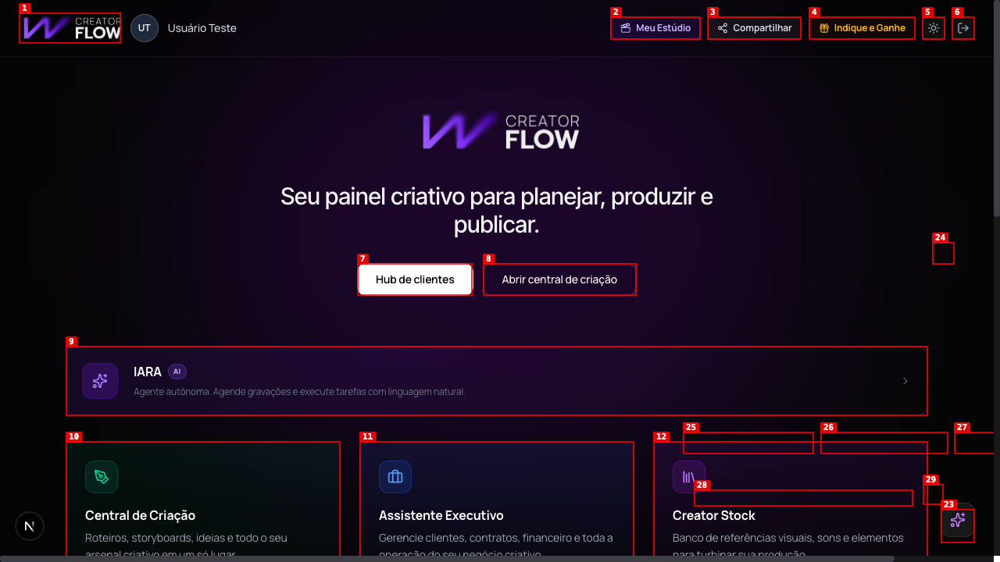
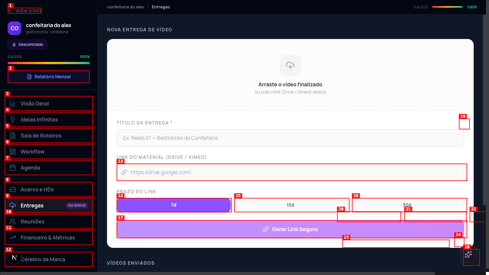
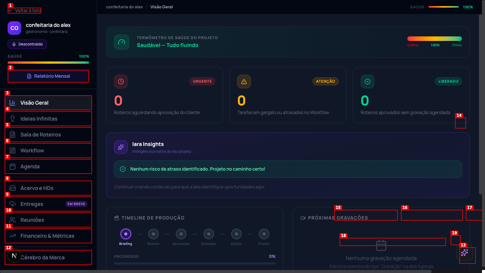
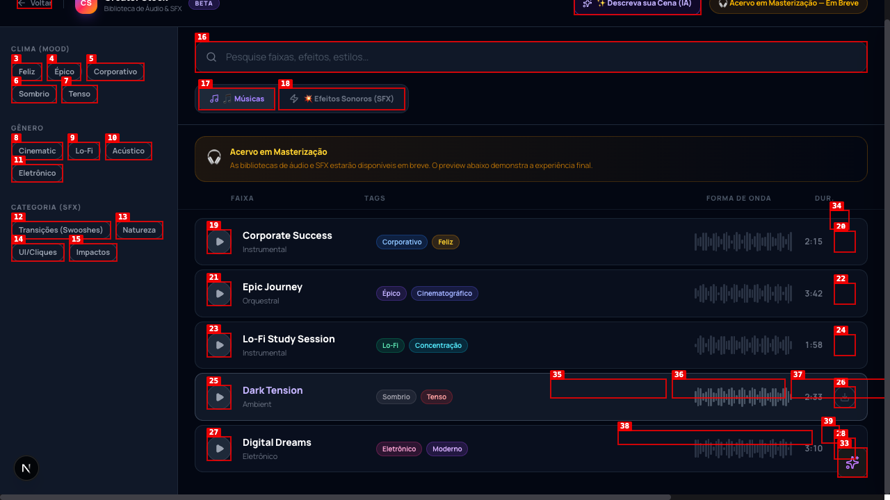
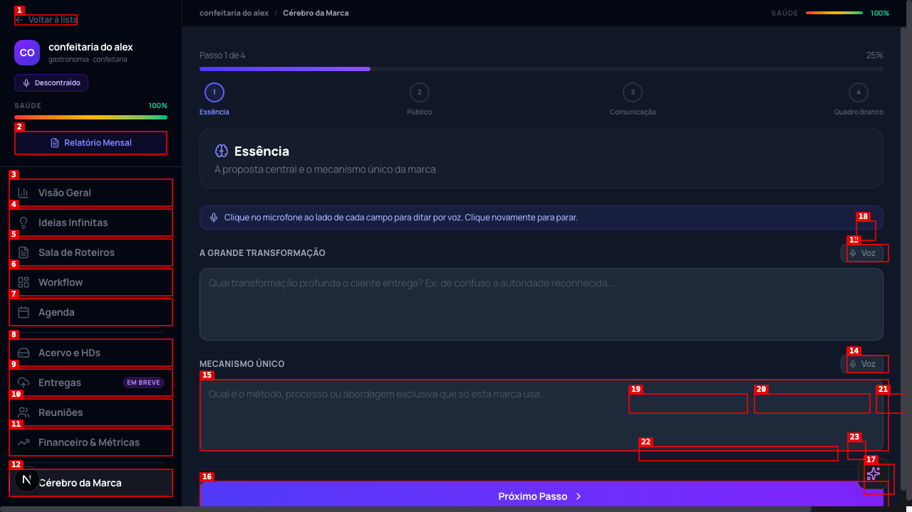
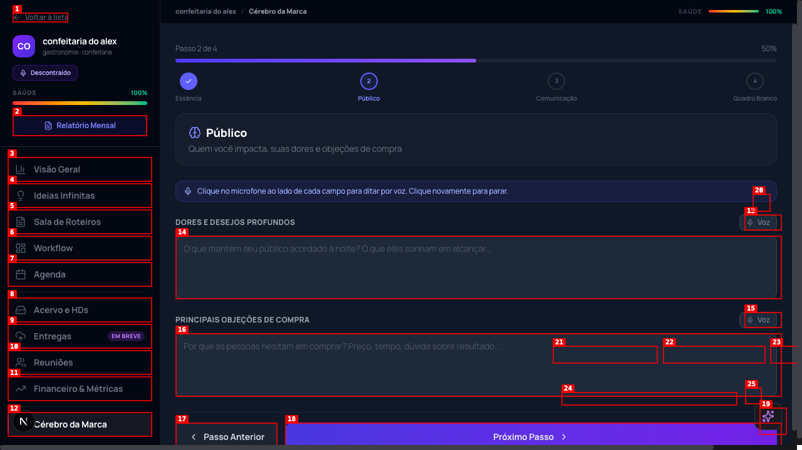
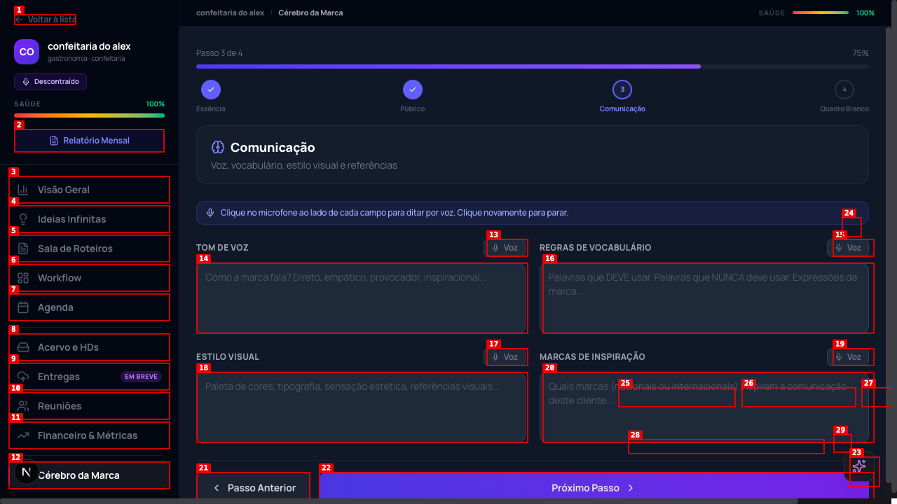

# Dogfood Report: CreatorFlow

| Field | Value |
|-------|-------|
| **Date** | 2026-03-06 |
| **App URL** | http://localhost:3000 |
| **Session** | localhost-3000 |
| **Scope** | Full app - dashboard and all modules |

## Summary

| Severity | Count |
|----------|-------|
| Critical | 0 |
| High | 1 |
| Medium | 3 |
| Low | 1 |
| **Total** | **5** |

## Issues

### ISSUE-001: Next.js scroll-behavior warning in console

| Field | Value |
|-------|-------|
| **Severity** | medium |
| **Category** | console |
| **URL** | http://localhost:3000/dashboard |
| **Repro Video** | N/A |

**Description**

Next.js warning appears in browser console on every page: "Detected `scroll-behavior: smooth` on the `<html>` element. In a future version, Next.js will no longer automatically disable smooth scrolling during route transitions. To prepare for this change, add `data-scroll-behavior="smooth"` to your <html> element."

This is a deprecation warning indicating the app needs to be updated before a future Next.js version release.

**Repro Steps**

1. Open the application and login
   

2. Open browser DevTools console
   - Warning is immediately visible and repeats on page navigation
   

---

### ISSUE-002: Autocomplete attribute missing on input elements

| Field | Value |
|-------|-------|
| **Severity** | low |
| **Category** | console |
| **URL** | http://localhost:3000/dashboard |
| **Repro Video** | N/A |

**Description**

Verbose DOM warning in console: "[DOM] Input elements should have autocomplete attributes (suggested: 'current-password')"

Input elements (especially password fields) should have explicit autocomplete attributes to enable browser password managers and improve UX.

**Repro Steps**

1. Open application and navigate to any page with input fields
   

2. Open browser console (DevTools)
   - Warning appears in verbose output during navigation
   

---

### ISSUE-003: Multiple features marked "Em Breve" without clear timeline

| Field | Value |
|-------|-------|
| **Severity** | medium |
| **Category** | ux |
| **URL** | http://localhost:3000/dashboard, client workspaces, creator-stock |
| **Repro Video** | N/A |

**Description**

Several key features are marked as "Em Breve" (Coming Soon) without providing users with clear timeline or release date:

- "Entregas" tab in client workspace shows "Em breve" badge but is still clickable/navigable
- "Auxiliar Financeiro" card in dashboard shows "Em Breve"
- Multiple "Download" buttons in Creator Stock library labeled "Download — Em Breve"
- Other unimplemented features: "Privacidade (em breve)", "Termos (em breve)", "Cookies (em breve)"

Users may attempt to use these features expecting functionality, creating frustration.

**Repro Steps**

1. Navigate to Dashboard and scroll down to "Auxiliar Financeiro" section
   

2. Enter a client panel and navigate to "Entregas" tab - notice the "Em breve" badge
   
   

3. Navigate to Creator Stock and observe multiple "Download — Em Breve" buttons
   

---

### ISSUE-004: Confusing step labeling in "Cérebro da Marca" wizard

| Field | Value |
|-------|-------|
| **Severity** | medium |
| **Category** | ux |
| **URL** | http://localhost:3000/clientes/confeitaria-do-alex/cerebro-marca |
| **Repro Video** | N/A |

**Description**

Multi-step wizard displays confusing step indicators. The step labels show "Essência 2 Público 3 Comunicação 4 Quadro Branco" which is unclear. It's ambiguous whether the numbers (2, 3, 4) are step numbers or internal IDs. Current step shows "Passo 2 de 4 50%" with this ambiguous labeling.

**Repro Steps**

1. Navigate to client panel and open "Cérebro da Marca" tab
   

2. Click "Próximo Passo" to advance to step 2
   

3. Observe the step indicators: "Essência 2 Público 3 Comunicação 4"
   - Unclear if these are step numbers, internal IDs, or some other identifier
   

---

### ISSUE-005: Excessive "Fast Refresh" rebuilds in development console

| Field | Value |
|-------|-------|
| **Severity** | high |
| **Category** | performance |
| **URL** | http://localhost:3000/dashboard |
| **Repro Video** | N/A |

**Description**

Browser console shows numerous "[Fast Refresh] rebuilding" logs during normal navigation. During exploration, 20+ rebuild entries appeared with rebuild times of 100-400ms per entry. This suggests:

1. Development server is overly sensitive to file changes
2. Excessive component re-rendering during navigation
3. HMR (Hot Module Replacement) triggering unnecessarily

While primarily a development concern, this pattern may indicate production performance issues if components are re-rendering unnecessarily.

**Repro Steps**

1. Open application and login
   

2. Open browser console (DevTools)
   - Multiple "[Fast Refresh] rebuilding" messages visible

3. Navigate through different pages (Dashboard → Central de Criação → Entregas → Creator Stock)
   - Console logs accumulate with each navigation (20+ entries observed)
   
   

---

## Session Notes

**Pages Explored:**
- Dashboard / Home
- Hub de Clientes (Client Hub)
  - Business Intelligence
  - Gestão de Clientes (Client Management)
  - Client Panel (confeitaria do alex)
    - Visão Geral (Overview)
    - Entregas (Deliverables)
    - Cérebro da Marca (Brand Brain) - multi-step wizard
- Central de Criação (Creation Center)
  - Gerador de Roteiros (Scriptwriter)
- Minha Conta (My Account)
- Creator Stock

**Positive Findings:**
- Clean, intuitive dashboard layout
- Good navigation structure across multiple modules
- IARA AI assistant readily accessible
- Professional design and typography
- Comprehensive feature set for audiovisual production management

**Session Duration:** ~30 minutes of systematic exploration

---
